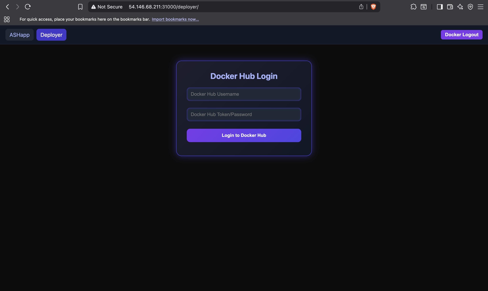
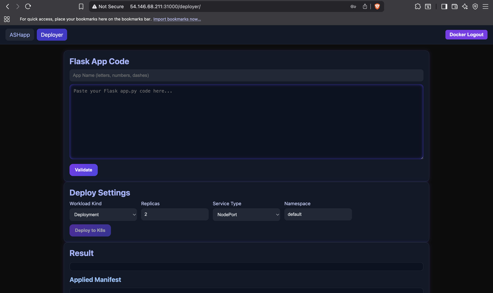
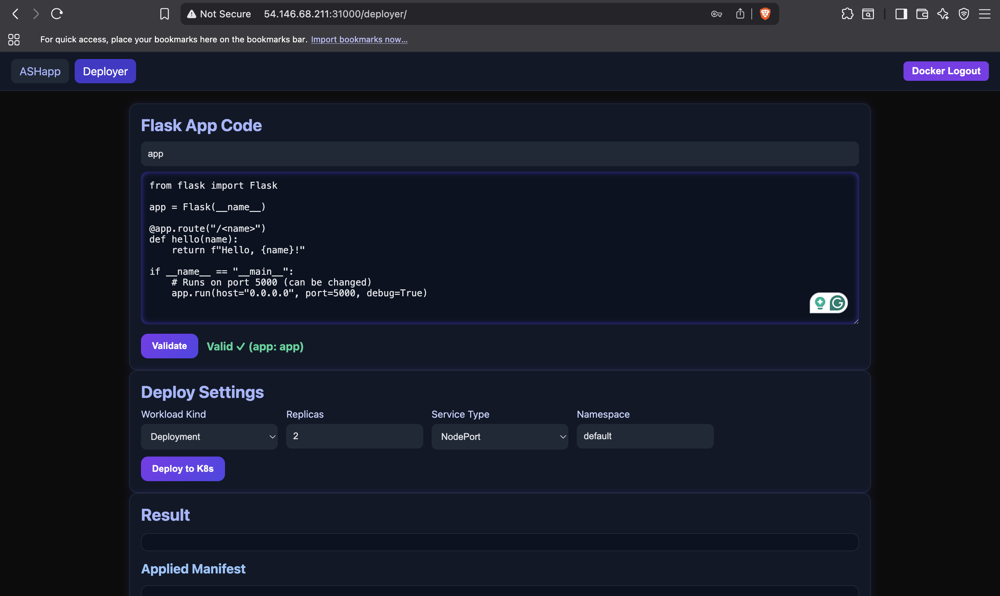
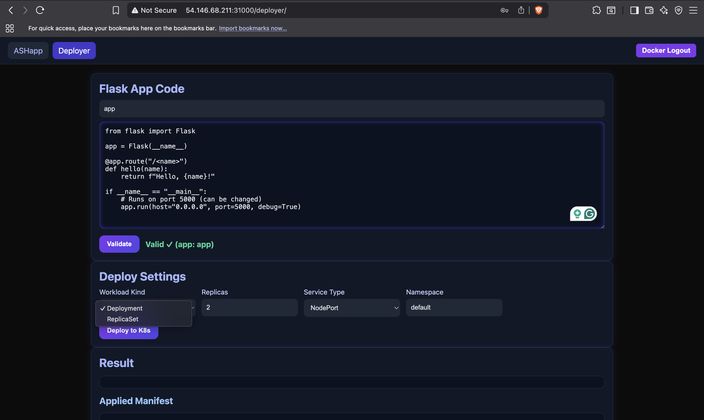
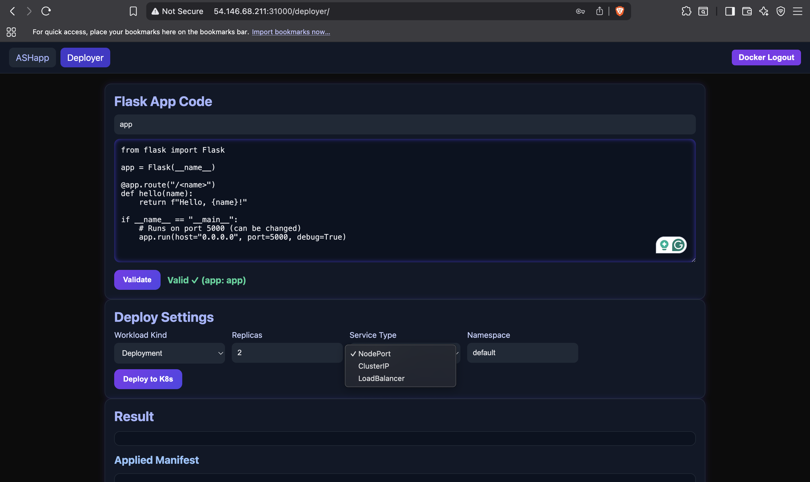
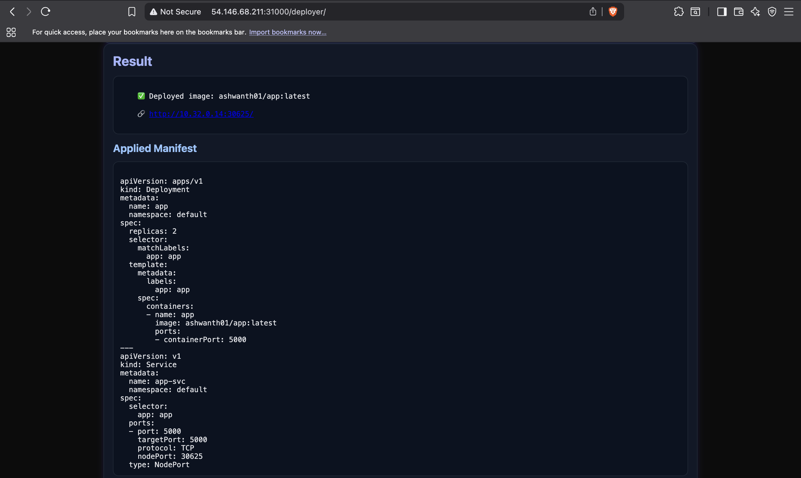
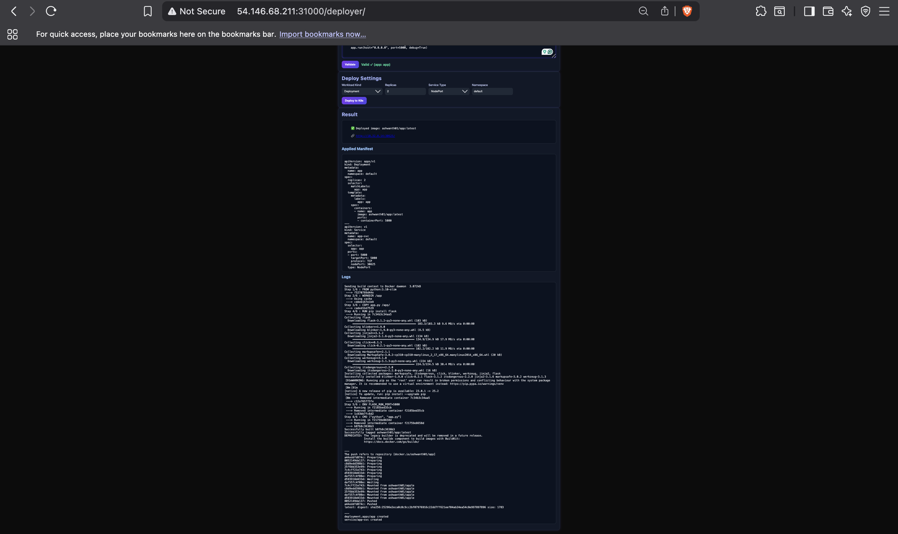
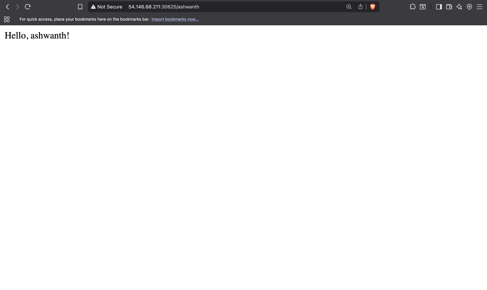
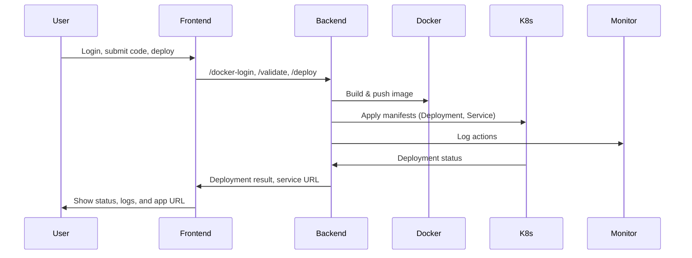

# Project Working Screenshots

Here are some working screenshots of the project:

## Screenshots

### Screenshot 1


### Screenshot 2


### Screenshot 3


### Screenshot 4


### Screenshot 5


### Screenshot 6


### Screenshot 7


### Screenshot 8



## Overview

**AUTODEPLOY-MICROSERVICE** is a self-service platform that enables users to deploy their own Python Flask applications to a Kubernetes cluster with minimal effort. The system provides a web-based interface for users to:

- Log in to Docker Hub
- Validate their Flask application code
- Build and push Docker images
- Deploy applications to Kubernetes
- Monitor deployment status and logs

This platform is ideal for educational, demo, or internal environments where users need to quickly test and deploy containerized Python web apps.

---

## Workflow

1. **User Authentication**:  
   Users log in with their Docker Hub credentials via the web UI.

2. **Code Submission & Validation**:  
   Users paste their Flask app code into the UI. The backend validates the code to ensure it is a valid Flask application.

3. **Image Build & Push**:  
   The backend builds a Docker image from the submitted code and pushes it to the user's Docker Hub repository.

4. **Kubernetes Deployment**:  
   The system generates Kubernetes manifests (Deployment and Service) and applies them to the cluster, deploying the user's app.

5. **Service Exposure**:  
   The deployed app is exposed via a Kubernetes Service (NodePort, ClusterIP, or LoadBalancer), and the user is provided with a URL to access their app.

6. **Monitoring & Logging**:  
   All actions are logged and sent to a monitoring service for auditing and troubleshooting.

---

## System Architecture

### High-Level Design Diagram

```mermaid
flowchart TD
    A[User (Web UI)] -->|HTTP (REST)| B[Flask Backend API]
    B -->|Docker CLI| C[Docker Daemon]
    B -->|Kubernetes CLI| D[Kubernetes Cluster]
    B -->|HTTP| E[Monitoring Service]
    D --> F[Deployed Flask App]
    F -->|HTTP| G[User]
```

### Component Breakdown

- **Frontend**:  
  A simple HTML/JS web interface for user interaction.

- **Backend (Flask API)**:  
  Handles authentication, code validation, Docker image build/push, Kubernetes manifest generation, deployment, and logging.

- **Docker Daemon**:  
  Used by the backend to build and push images.

- **Kubernetes Cluster**:  
  Hosts the deployed Flask applications.

- **Monitoring Service**:  
  Receives logs and action summaries from the backend.

---

## UML Sequence Diagram



---

## API & Service Calls

### Main API Endpoints

- `POST /deployer-api/docker-login`  
  Authenticates the user with Docker Hub.

- `POST /deployer-api/docker-logout`  
  Logs out the user from Docker Hub.

- `POST /deployer-api/validate`  
  Validates the submitted Flask app code.

- `POST /deployer-api/deploy`  
  Builds the Docker image, pushes it, generates Kubernetes manifests, and deploys the app.

### Service Interactions

- **Docker**:  
  Used for building and pushing images via the Docker CLI.

- **Kubernetes**:  
  Manifests are generated and applied using `kubectl` to create Deployments and Services.

- **Monitoring**:  
  All user actions and deployment results are sent to a monitoring endpoint for logging.

---

## Kubernetes Resources

- **Deployment**:  
  Manages the running pods for each user app.

- **Service**:  
  Exposes the app (NodePort, ClusterIP, or LoadBalancer).

- **HorizontalPodAutoscaler**:  
  (Optional) Scales the app based on CPU usage.

- **NetworkPolicy**:  
  Restricts network access to/from the deployed app.

- **RBAC**:  
  Roles and RoleBindings ensure the backend has the necessary permissions.

---

## How It Works (Summary)

1. User logs in and submits Flask code.
2. Backend validates code, builds Docker image, and pushes to Docker Hub.
3. Backend generates Kubernetes manifests and deploys the app.
4. User receives a URL to access their deployed app.
5. All actions are logged for monitoring and audit.

---

## Notes

- No user code is stored; only Docker images and Kubernetes resources are created.
- The system is designed for demo and educational use, not for production workloads.
- All credentials and sensitive data are masked in logs.

---

